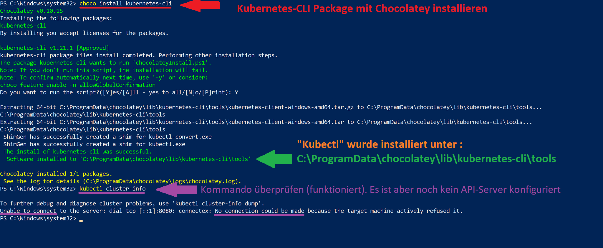

[10]: https://chocolatey.org/install
[20]: https://kubernetes.io/de/docs/tasks/tools/install-kubectl/
[30]: https://rancher.com/learning-paths/how-to-manage-kubernetes-with-kubectl/

# M300-MAAS-Kubernetes-CLI Setup

Dieses Tutorial unterstützt Dich dabei, den eigenen Windows-Client so aufzusetzen, dass anschliessend eine RESTful-Verbindung zum persönlichen MAAS-Kubernetes API-Server besteht. Dieses Setup ermöglicht es, deklarative Scripts an den K8s API-Server (Control Plane, Master-Node) zu übermitteln und so verschiedene K8s-Übungen durchzuführen. 

Diese deklarativen Scripts sind yaml (oder json)-Files und werden mit dem Kommando **kubectl** dem Control Plane (K8s-Server oder auch Master-Node genannt) übergeben. **kubectl** ist per Default noch nicht auf dem System und muss runtergeladen werden

## Vorgehen:
- [Chocolatey][10] installieren: Windows Package-Manager (nicht zwingend)
- [kubectl][20] installieren: **CLI**, um Anwendungen auf Kubernetes bereitzustellen und zu verwalten

### Chocolatey installieren unter Windows (nicht zwingend)
PowerShell Kommando (als Administrator) -> Copy/Paste
```
Set-ExecutionPolicy Bypass -Scope Process -Force; [System.Net.ServicePointManager]::SecurityProtocol = [System.Net.ServicePointManager]::SecurityProtocol -bor 3072; iex ((New-Object System.Net.WebClient).DownloadString('https://chocolatey.org/install.ps1'))
```

### Kubernetes-CLI (kubectl) installieren mit Chocolatey
Auf [DIESER URL][20] findest Du die **kubectl**-Installationsanleitung für div. Betriebssysteme. <br>
Mit **kubectl** können Clusterressourcen überprüft werden, Komponenten erstellt, gelöscht und aktualisiert werden; Man kann den neuen Cluster betrachten; und Beispielanwendungen aufrufen.

Der folgende Screenshot zeigt die Installation auf Windows mit dem Package-Manager [Chocolatey][10]:

> `$ choco inst kubernetes-cli` _K8s-CLI Package mit Chocolatey installieren_<br>
> `$ kubectl cluster-info  ` _Checken, ob **kubectl** Output generiert (Pfad ok)_ <br>
   

Packete die mit Chocolatey installiert werden, werden abgelegt unter: 
```
 C:\ProgramData\chocolatey\lib\
```

**kubectl** liegt in folgendem Verzeichnis:<br>

```
C:\ProgramData\chocolatey\lib\kubernetes-cli\tools
```
...dies für den Fall, dass die **$PATH**-Variable noch ergänzt werden muss (sollte allerdings im Normfall nicht nötig sein)

...weitere Infos folgen


- - - 

## Quellen
- [How to Manage Kubernetes with kubectl][30] 
